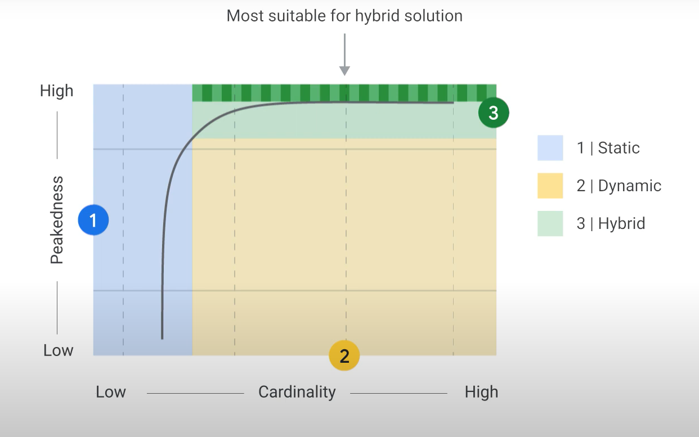

# Architecting ML Systems

# Serving Design Decisions

## Serving Architecture

- One of our goals is to minimize average latency in serving architecture design.

- Just as use cases determine training architecture, they also influence serving architecture.

- **Static Serving:**
  - Computes the label ahead of time.
  - Serves by looking up in a table (cache).
  - Space-intensive, higher storage costs, low fixed latency, lower maintenance costs.

- **Dynamic Serving:**
  - Computes the label on demand.
  - Compute-intensive, lower storage costs, higher maintenance, variable latency.

- **Space-Time Trade-off:**
  - Choose between static and dynamic based on considerations of costs (latency, storage, CPU).

- **Peakedness and Cardinality:**
  - **Peakedness:** Degree of concentration in data distribution.
    - Highly peaked: Predicting the next word in a keyboard app.
    - Flat: Predicting quarterly revenue for all sales verticals.
  - **Cardinality:** Number of values in a set. All the possible things we might have to make predictions for.
    - Low cardinality: Model predicting sales revenue by organization division.
    - High cardinality: Model predicting lifetime value in an e-commerce platform.

- **Hybrid Serving:**
  - Combines static and dynamic serving.
  - Best for distributions that are sufficiently peaked.
  - Most frequently requested predictions cached, long tail computed on demand.

- **Graphical Representation:**
  - Area highlighted in green the hybrid solution
    - Most frequesntly requested predictions cached
    - Tail computed on demand

  

- **Examples of Use Cases:**
  1. **Spam Email Prediction:**
     - Inference style: Dynamic
     - Distribution not peaked, high cardinality.

  2. **Android Voice-to-Text:**
     - Inference style: Dynamic or Hybrid
     - Long tail of voice clips, potential for pre-computed answers.

  3. **Shopping Ad Conversion Rate:**
     - Inference style: Static
     - Set of ads doesn't change much, suitable for static serving.

- **Estimating Training and Inference Needs:**
  - Consider peakedness and cardinality for each use case.
  - Hybrid approach often practical, caching frequently requested predictions.

- **Static Serving System Design:**
  - Three design changes for a static serving system:
    1. Switch from online to batch prediction job.
    2. Ensure model accepts and passes through keys as input.
    3. Write predictions to a data warehouse (e.g., BigQuery) and create an API to read from it.

## Designing from Scratch

### Use Case: Traffic Prediction System for Municipal Transit

### Business Constraints and System Design Tradeoffs
- Municipal transit head requests a system predicting traffic levels.
- Understand business constraints for appropriate system design tradeoffs.
- Data: City-wide sensors recording car movements around, sensor locations, road characteristics.

### Training Architecture
- **Nature of Relationship between features and labels:** More like fashion trends than physics.
- **Complexity:** Cities are complex systems with dynamic changes (e.g., technology, events).
- **Dynamic Training:** Reflects dynamic relationships due to city complexity and changing factors.

### Serving Architecture
- **Distribution of Prediction Requests:**
  - Likely more peaked due to domimation from most heavily trafficked roads.
- **Cardinality of Prediction Requests:**
  - Need more information.
  - Depends on historical traffic data and problem framing.
  - Not dependent on the variance of traffic levels.

### Cardinality Determinants
- **Dependent Factors:**
  - Historical traffic data
  - Problem framing
  - **Not:** Variance of traffic levels

### Framing the Problem
- Uncertainty in:
  - Prediction frequency (minute, hour, day)
  - Spatial granularity (feet to blocks)
- Start conservatively, leading to lower cardinality initially.

### Generalization in Machine Learning
- Emphasizes generalization - leap of faith into unseen input.
- Users might want generalization:
  - In space (predictions far from sensors)
  - In time (future predictions with finer granularity than historical data)
  - Both

### Conclusion
- Consider conservative approaches initially for lower cardinality.
- Variance of traffic levels not crucial; it's a label, not a feature.

## Using Vertex AI

### Overview of Machine Learning Ecosystem

- **Decision-Making at Every Stage:**
  - Handling and preparing data
  - Designing, building, evaluating, training, and monitoring model performance
  - Workflow processes, implementation, and workflow management

- **Challenges in ML Ecosystem:**
  - ML code is a small percentage.
  - Running in production requires more than computing model outputs.
  - People are crucial for each component.

- **Success in ML/AI Use Case:**
  - Unified platform - Vertex AI
  - Brings all ML ecosystem components together.

### Introduction to Vertex AI

- **Vertex AI:**
  - Unified platform on Google Cloud.
  - Brings GCP services for ML under one UI and API.
  - Components: dashboard, datasets, features, labeling tasks, notebooks, pipelines, training, experiments, models, endpoints, batch predictions, metadata.

- **Note**: On Google Cloud, the three types of data ingestion map to three different products. If you are ingesting streaming data, use Pub/Sub. If you are ingesting structured data directly into your ML model, use BigQuery, and if you are transforming data from training so that you can train on it later, read from Cloud Storage.

### Data Preparation with Vertex AI

- **Data Preparation Tool:**
  - Supports image, tabular, text, and video content.
  - Uploaded datasets stored in Cloud Storage bucket.
  - Example: BigQuery table about movies.

- **Featurestore:**
  - Entities and feature values.
  - Timestamps as attributes of feature values.
  - Transformation for features during model training.

- **Notebooks:**
  - Managed service for data scientists.
  - Integrated JupyterLab environment.
  - Pre-installed with data science and ML frameworks.
  - Security: Google Cloud authentication and authorization.

### Model Training with Vertex AI

- **AutoML and Custom Code Training:**
  - Central model repository.
  - Training pipelines for AutoML or custom code.
  - Orchestration for custom training jobs and hyperparameter tuning.
  - Hyperparameter tuning specific to custom-trained models.

- **Models in Vertex AI:**
  - Built from datasets or unmanaged data sources.
  - Various ML models available.
  - Options: Train new model, import existing model.

- **Endpoints:**
  - Models made available for online prediction requests.
  - HTTPS endpoint for inferencing.
  - Can handle timely or batch predictions.
  - Deployment to an endpoint necessary for serving predictions.

# 

