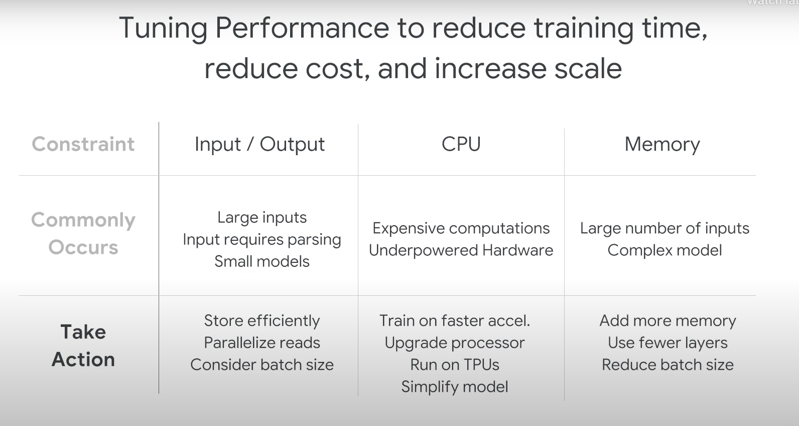

# Designing High Performance ML Systems

## Introduction

### Performance Considerations
- Performance is a key consideration in machine learning systems.
- The module emphasizes learning how to identify performance considerations specific to machine learning models.

### Focus on Performance Improvements
- Depending on the model, the focus could be on improving Input/Output (IO) performance or enhancing computational speed.

### Infrastructure Requirements
- The choice of machine learning infrastructure depends on the specific performance goals.
- Considerations include whether to scale out with multiple machines or scale up on a single machine using GPUs or TPUs.

### Acceleration Strategies
- In some cases, both scaling out and scaling up might be necessary, achieved by using a machine with multiple accelerators.

### Beyond Hardware
- Hardware selection is not the only factor; it also influences the distribution strategy chosen for the machine learning model.
- The chosen hardware informs decisions about how the model is distributed for optimal performance.

## Training

### Definition of High Performance in Machine Learning
- **High Performance** in machine learning can be defined in various ways:
  - Powerfulness
  - Handling large datasets
  - Speed of training
  - Ability to train for extended periods
  - Achieving the best accuracy

### Key Aspect: Time Taken to Train a Model
- **Critical Factor:** Time taken to train a model.
- Performance is assessed based on efficiency; for example, if one architecture takes less time to achieve the same accuracy as another, it is considered more performant.

### Module Assumption
- **Assumption:** Throughout the module, models with the **same accuracy** are considered.
- Focus on **infrastructure performance** rather than model accuracy.

### Budget Considerations
- **Critical Aspects of Budget:**
  - Time
  - Cost
  - Scale

## Time Considerations
- **Business Use Case Impact:** Time to train might be driven by the business use case.
- **Practical Constraints:** Deployment time, A/B testing, etc.
- **Example:** If a model needs to be trained daily, the training must finish within 24 hours.

### Cost Considerations
- **Business Decision:** Determining how much to spend on computing costs.
- **Incremental Benefit:** Avoid training for extended periods(eg. 20 hours everyday on an expensive machine) if the benefits are not substantial. 

### Scale Considerations
- **Model Computational Expense:** Models differ in computational requirements.
- **Data Size Impact:** More data generally leads to higher accuracy, but there are diminishing returns.
- **Infrastructure Choices:** Single expensive machine vs. multiple cheaper machines.
  
### Factors Limiting Model Training Performance
- **Three Key Factors:**
  - Input/Output
  - CPU
  - Memory

### IO-Bound Training
- **Indicators:**
  - Large, heterogeneous input data
  - Small models with trivial compute requirements
  - Input data on a low-throughput storage system
- **Improvements:**
  - - For fast IO in tensorflow, also consider using TF Records(efficient batch reads, without overhead of parsing data in python)
  - Faster accelerators (GPUs, TPUs)
  - Efficient data storage, storing the data on a storage system with higher throughput
  - Parallelizing reads
  - Reducing batch size (not ideal , last retort)

### CPU-Bound Training
- **Indicators:**
  - Simple IO but complex, computationally expensive models
  - Running on underpowered hardware
- **Improvements:**
  
  - Simpler models or activation functions
  - Training for fewer steps

### Memory-Bound Training
- **Indicators:**
  - Large input size or complex models with many parameters
  - Limited accelerator memory
- **Improvements:**
  - Adding more memory to individual workers
  - Using fewer layers in the model
  - Reducing batch size for memory-bound systems

## Predictions

### Batch Prediction
- **Key Considerations:**
  - Time for predictions (how long does it take to finish predictions)
  - Business-driven time constraints
    - Example: Precomputing top 20% user recommendations in 5 hours for 18 hours of training.
  - Cost considerations
  - Scale considerations
    - Single machine or distributed to multiple workers
    - Hardware availability on workers (e.g., GPUs)

### Online Prediction
- **Differences in Performance Considerations:**
  - Users wait for predictions here
  - Cannot distribute the prediction graph
  - Computation for one end user on one machine
  - Scaling out predictions to multiple workers
    - Each prediction handled by a microservice
    - Replication and scaling predictions using Kubernetes or AI Platform workbook
    - AI Platform workbook predictions as a higher-level abstraction
  
### Performance Metrics for Online Prediction
- **Performance Target:**
  - Queries per second (QPS)
  - Different from training steps per minute
- **Design Considerations:**
  - Separate design for training and performance, especially for online predictions
  - Balancing batch predictions and online predictions
  - Striking the right performance trade-off
  - Measurement necessary to determine the optimal trade-off (after building the system in most cases)

## Distributed Training Architectures

## Scaling in TensorFlow
It's crucial to understand the high-level concepts of distributed training.

- **Single Machine Scaling:**
  - TensorFlow automatically scales on multi-core CPUs.
  - Accelerators like GPUs can be added to speed up training with minimal effort.

- **Distributed Training:**
  - Progresses from one machine with a single device to multiple machines, possibly with multiple devices each.

## Distributed Training Architectures

Distributed training distributes workloads across worker nodes. Two common architectures are data parallelism and model parallelism.

### Data Parallelism

Data parallelism is model-agnostic and widely used for parallelizing neural network training.

- **Working Principle:**
  - Same model and computation run on every device.
  - Each device trains on different data samples.
  - Loss and gradients are computed independently on each device based on the samples that it sees.
  - The updated model is then
used in the next round of computation.

- **Gradient Calculation:**
  - Synchronous: Devices communicate gradients and update model collectively.
  - Asynchronous: Devices can run independently, communicating with peers or through parameter servers.

- **Pros and Cons:**
  - Synchronous: Overhead in gradient calculation due to waiting for all devices.
  - Asynchronous: Potential out-of-sync issues, but scales well with no waiting.

### The Two Data Parallelism approaches
There are currently 2 approaches used to update the model using gradients from
various devices.
- **Async parameter server**
  - Some devices are designated to be parameter servers, and others as workers
  -  Each worker independently fetches the latest parameters from the PS and computes gradients based on a subset training samples.
  - It then sends the gradients back to the PS. Which then updates its copy of the parameters with those gradients.
  - Each worker does this independently. This allows it to scale well to a large number of workers.
  - These don’t hurt the scaling because workers are not waiting for each other.
  - The downside of this approach, however, is that workers get out of sync. They compute parameter updates based on stale values and this can delay convergence.
- **Sync allreduce architecture**
  - Each worker holds a copy of the model’s parameters - there are no special servers holding the parameters.
  - Each worker computes gradients based on the training samples they see and communicate between themselves to propagate the gradients and update their parameters.
  - All workers are synchronized - conceptually the next forward pass doesn’t begin until each worker has received the gradients and updated their parameters
  - With better links and low sync overhead, this may help faster covergence. 

### Model Parallelism

A simple way to describe model parallelism is when your model is so big that it
doesn’t fit on one device’s memory. So you divide it into smaller parts that compute
over the same training samples on multiple devices.

- **Working Principle:**
  - Each processor gets the same data but applies a different parts of the model.
  - Weights of the net are split equally among threads.
  - For example, you could put different layers on different devices.

- **Challenges:**
  - Synchronization needed after each layer for input to the next layer.
  - Assigning layers to GPUs is more complex than data parallelism.

### Hybrid Approach

Sometimes, a hybrid of data and model parallelism is used in the same architecture for optimal results.

## Choosing the Right Approach

The choice between asynchronous parameter server and synchronous Allreduce approaches depends on the characteristics of the model.

- **Asynchronous Parameter Server:**
  - Suitable for sparse models with fewer features.
  - Consumes less memory, ideal for clusters of CPUs.

- **Synchronous Allreduce:**
  - Preferred for dense models with many features.
  - All machines share the load of storing and maintaining global parameters.

In conclusion, there's no one-size-fits-all solution, and the choice depends on the specific requirements and characteristics of the model being trained.
## TF Distributed Training Strategies
There are four TensorFlow distributed training strategies that support data parallelism.
## Distributed Training with Mirrored Strategy

### Introduction
- **Mirrored Strategy:** Simplest approach for distributed training.
- **Use Case:** Single machine with multiple GPU devices.

### Mirrored Strategy Basics
- Replica Creation:
  - Mirrored strategy replicates the model on each GPU.
- Data Distribution:
  - During training, a minibatch is split into "n" parts (number of GPUs).
  - Each part is fed to one GPU device.
- Coordination:
  - Mirrored strategy manages data distribution and gradient updates across GPUs.

### Image Classification Example
- Keras ResNet model with functional API.
- Data Preparation:
  - Download Cassava dataset from TensorFlow datasets.
  - Implement a preprocess_data function to scale images.
  - Map, shuffle, and prefetch data.
- Model Definition:
  - Define the ResNet model using the functional API.

### Implementing Mirrored Strategy
1. Create a MirroredStrategy object using `tf.distribute.MirroredStrategy`.
2. Model Configuration:
   - Define model variables within the strategy scope.
   - Variables include loss, optimizer, and metrics for accuracy.
3. Adjust Batch Size:
   - Batch size in distributed training now refers to the global batch size.
   - Global Batch Size: Total across all GPUs.
   - Per Replica Batch Size: Batch size processed by each GPU.
   - Scale batch size by the number of replicas.
4. Data Processing:
   - Map, shuffle, and prefetch the data.

### Training Process
1. Call `model.fit` on the training data.
2. Scaling Batch Size:
   - Adjust batch size to utilize multiple GPUs effectively.
   - Each machine processes a fraction of the global batch size.
   - Example: If global batch size is 64 with two GPUs, each processes 32 examples per step.
3. Run Training:
   - Run multiple passes (epochs) of the entire training dataset.

### Understanding Model.fit without Strategy
- Example with Simple Linear Model:
  - Computational graph (DAG) with matmul and add operations.
  - Explanation of data parallelism with two GPUs.
  - Each GPU processes different slices of the input batch.

### Conclusion
- Mirrored strategy simplifies distributed training on a single machine with multiple GPUs.
- Scaling batch size ensures optimal GPU usage.

## Multi-worker Mirrored Strategy

**1. Introduction to Multi-Worker Mirrored Strategy**
   - Multi-worker mirrored strategy is an extension of mirrored strategy.
   - Synchronous distributed training across multiple workers, each potentially having multiple GPUs.
   - Like mirrored strategy, it involves creating copies of all model variables on each device across all workers.

**2. Scaling Training with Multiple Machines**
   - To scale training further, add multiple machines to the cluster.
   - Machines can be CPU-only or have one or more GPUs.
   - Particularly useful when looking to enhance performance beyond single-host training.

**3. Code Adaptation for Multi-Worker Mirrored Strategy**
   - Similar to single-worker mirrored strategy, multi-worker mirrored strategy employs synchronous data parallelism.
   - Requires minimal code changes for implementation.

**4. TensorFlow Cluster Configuration**
   - Unlike mirrored strategy, multi-worker setup requires TensorFlow to know which machines are part of the cluster.
   - Specification typically involves the use of the "TF_CONFIG" environment variable.
   - "TF_CONFIG" example includes a "cluster" key with internal IPs and ports of all machines.

**5. Worker Designation in Multi-Worker Mirrored Strategy**
   - All machines in multi-worker mirrored strategy are designated as "workers."
   - One worker takes on additional responsibilities as the "chief" or "master."
   - The chief handles tasks such as saving checkpoints and writing summary files to TensorBoard.

**6. TF_CONFIG Setup in AI Platform Training**
   - When using AI Platform training, TF_CONFIG is conveniently set on each machine in the cluster.
   - Eliminates the need for manual TF_CONFIG setup.

**7. Steps for Implementation**
   - Step 1: Create a strategy object from the tf.distribute module.
   - Step 2: Wrap the creation of model parameters within the scope of the strategy to specify variables for mirroring.
   - Step 3: Scale the batch size by the number of replicas in the cluster.

**8. Handling Gradients in Multi-Worker Setup**
   - Gradients at the end of each step need synchronization across all GPUs in a machine and across all machines in the cluster.
   - This synchronization step increases distribution overhead.

**9. Sharding Data in Multi-Worker Mirrored Strategy**
   - Data needs to be sharded in a multi-worker setup, meaning each worker is assigned a subset of the entire dataset.
   - Autosharding is recommended, as it prevents each replica from processing every example in the dataset.

**10. Autosharding with tf.data.experimental.AutoShardPolicy**
   - Autosharding is handled by tf.data.experimental.AutoShardPolicy.
   - Default policy is set to AUTO, sharding data based on whether it is file-based or not.

**11. Saving Model in Multi-Worker Scenario**
   - Saving the model is more complex in multi-worker setups, requiring different destinations for each worker.
   - The chief worker saves to the desired model directory, while other workers save to temporary directories.
   - Temporary directories must be unique to avoid conflicts.
   - All workers, not just the chief, must participate in saving, and it can contain collective ops.

## TPU Strategy

### Introduction to Distribution Strategies
- **TPUStrategy Overview**
  - Similar to MirroredStrategy but designed for Tensor Processing Units (TPUs).
  - TPUStrategy performs all-reduce across TPU cores.
  - TPUs are Google's specialized ASICs for accelerating machine learning workloads.

### TPUStrategy and Tensor Processing Units (TPUs)

- **Implementation with TPUStrategy**
  - Use `tf.distribute.TPUStrategy` to run TensorFlow training on TPUs.
  - Requires a variable named "strategy," chosen with `tf.distribute.TPUStrategy` method.

### Challenges and Solutions with TPUStrategy
- **Data Bottleneck on TPUs**
  - Fast TPUs may lead to a data bottleneck during training.
  - TPU sits idle, waiting for data for a significant part of each training epoch.
- **Reading Data from Google Cloud Storage (GCS)**
  - TPUs read training data exclusively from Google Cloud Storage (GCS).
  - GCS can sustain large throughput when continuously streaming from multiple files in parallel.
- **Optimizing Throughput**
  - Best practices involve optimizing throughput for efficient TPU usage.
  - Balancing the number of files to avoid bottlenecks and wasted time accessing individual files.

### Implementation Details
- **Required Variable: "strategy"**
  - Utilize the `tf.distribute.TPUStrategy` method to set up the strategy variable.
- **Code Summary for Distribution Strategies**
  - Base model: Keras Sequential model.
  - Strategies for improvement:
    - `MirroredStrategy` for basic enhancement.
    - `MultiWorkerMirroredStrategy` for faster training.
    - `TPUStrategy` for exceptionally fast training on TPUs.

## Parameter Server Strategy

### **Introduction:**
- Explored the asynchronous parameter server architecture.
- Parameter server training cluster comprises Workers and Parameter Servers.

### **Roles of Workers and Parameter Servers:**
- Variables are created on Parameter Servers.
- Workers read and update these variables in each step.
- By default, Workers operate independently without synchronization.

### **Introduction of TensorFlow Parameter Server Strategy:**
- TensorFlow parameter server strategy adds a central coordinator.
- Coordinator is a special task type responsible for creating resources, dispatching training tasks, writing checkpoints, and handling task failures.
- Creation of parameter server strategy object similar to other strategies.

### **Dataset Function Details:**
- Code in `dataset_fn` invoked on the input device (usually CPU) on each Worker machine.
- Recommended to shuffle and repeat the dataset when using the parameter server strategy.
- Parse in the `steps per epoch` argument to `model.fit`.

### **Summary:**
- Asynchronous parameter server architecture involves Workers and Parameter Servers.
- TensorFlow parameter server strategy adds a Coordinator for centralized control.
- Creation of the parameter server strategy object, including the use of ClusterResolver.
- Use of `model.fit` with specific requirements for input data and dataset functions.
- Important considerations for dataset functions, including shuffling, repeating, and specifying steps per epoch.

## Inference

Performance Considerations in Model Inference

**1. Introduction**
- High-performance inference involves considerations such as throughput(QPS), latency, and costs.

**2. Approaches to Implementation**
- Three main approaches discussed for implementing high-performance inference:
    1. Deployed Model using REST or HTTP API for *streaming pipelines*.
    2. AI Platform Notebooks batch prediction jobs for batch pipelines.
    3. Cloud Dataflow direct-model prediction for both batch and streaming pipelines.

**3. Understanding "Batch" in Inference**
- The term "batch" in inference refers to a bounded dataset.
- Batch data pipeline involves reading from persistent storage (data lake or data warehouse), processing, and writing to the same or different format.
- Cloud Dataflow enriches data with predictions from an ML model.

**4. Options for Enriching Data with Predictions**
- Two options discussed:
    1. Using TensorFlow SavedModel loaded into the Dataflow pipeline.
    2. Using TensorFlow Serving accessed via an HTTP endpoint (microservice) from AI Platform Notebooks or Kubeflow on Kubernetes.

*Insert Image for batch inferencing*

**5. Performance Comparison for Batch Pipelines**
- AI Platform Notebooks batch predictions provide the highest raw processing speed.
- Loading the SavedModel directly into Dataflow is the next fastest.
- TensorFlow Serving on AI Platform Notebooks is slightly slower in terms of speed.
- For maintainability, batch predictions using AI Platform notebooks are still the best(fully managed service), but TF Serving (online predictions as a microservice) allow for easier upgradability and dependency management that loading the SavedModel.

**6. Streaming Pipelines**
- Streaming pipelines involve reading from an unbounded source (e.g., pub/sub) and processing with Dataflow.
- Options for predictions in streaming pipelines: TensorFlow SavedModel or TensorFlow Serving on AI Platform Notebooks.

**7. Performance Considerations for Streaming Pipelines**
- The SavedModel approach is the fastest for streaming pipelines.
  - Minibatching is recommended to reduce the gap between TensorFlow Serving HTTP endpoint and directly loading the model into the client.
- AI Platform Notebooks approach is more maintainable, especially for multiple clients.

**8. Scalability Considerations**
- As the number of queries per second increases, the feasibility of the SavedModel approach may decrease.
- AI Platform Notebooks approach is considered to scale indefinitely.

